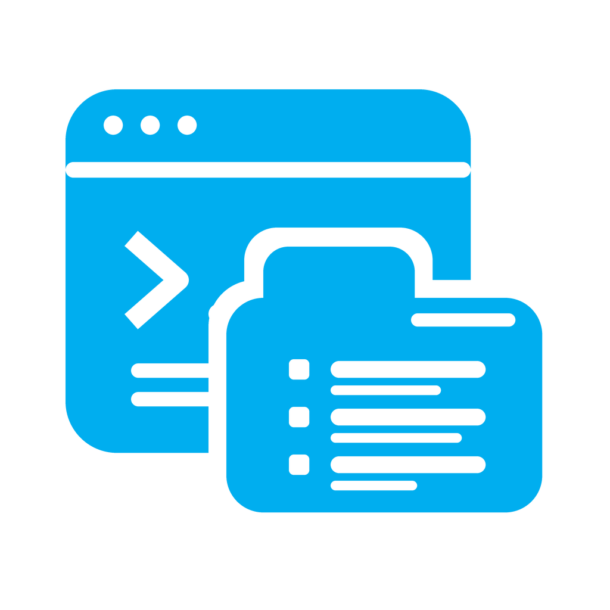
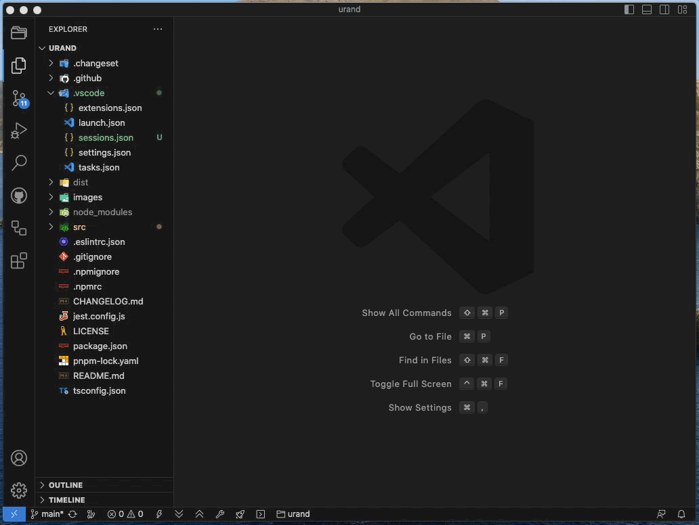
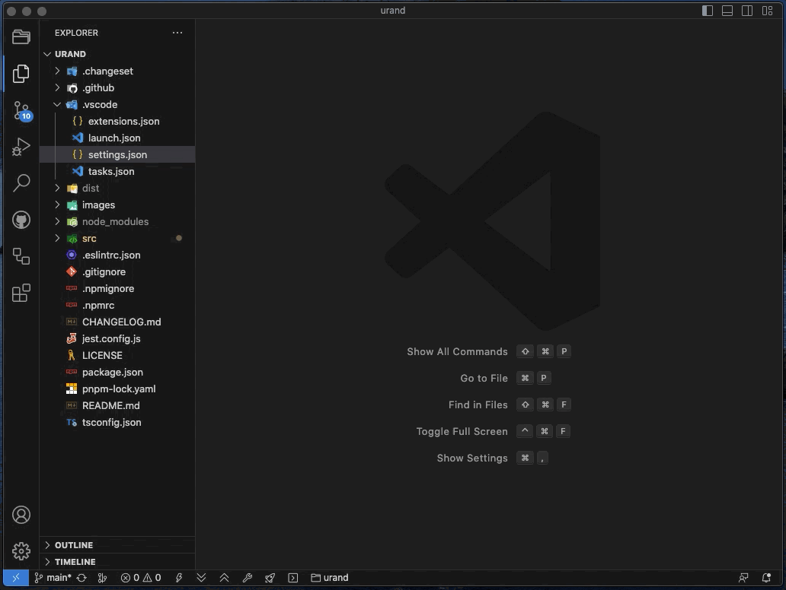
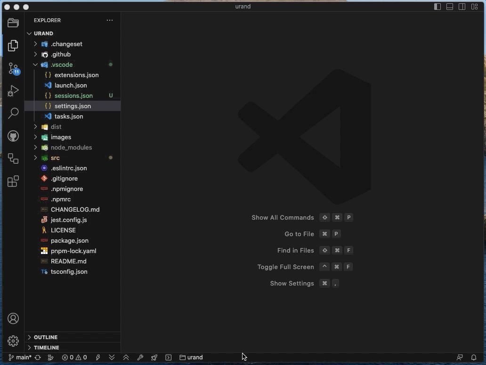
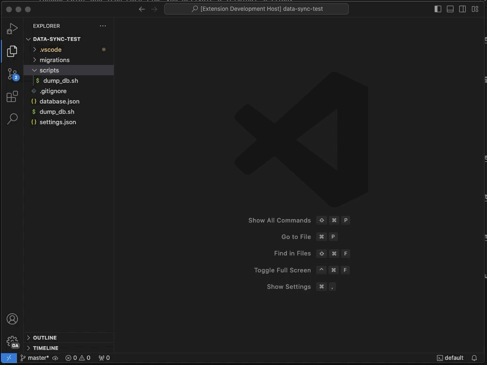
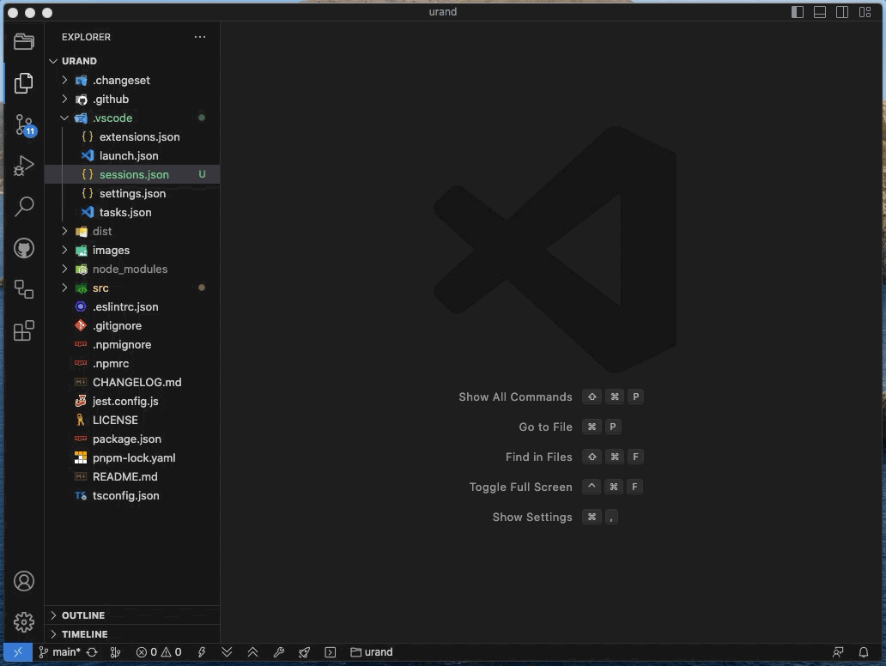
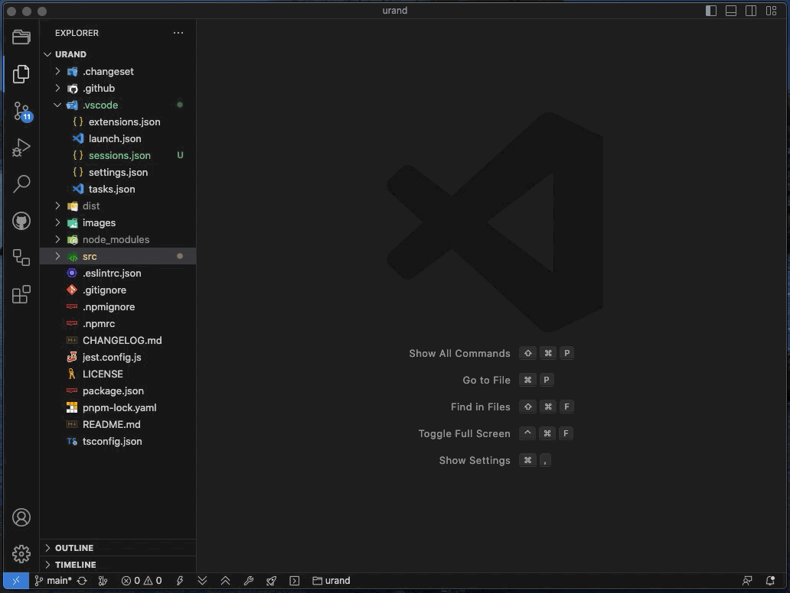

<p align="center">
  
</p>

[](https://marketplace.visualstudio.com/items?itemName=zbigniewpowroznik.terminal-organizer)
[](https://open-vsx.org/extension/zbigniewpowroznik/terminal-organizer)
[](https://marketplace.visualstudio.com/items?itemName=zbigniewpowroznik.terminal-organizer)
[](https://marketplace.visualstudio.com/items?itemName=zbigniewpowroznik.terminal-organizer)
[](https://marketplace.visualstudio.com/items?itemName=zbigniewpowroznik.terminal-organizer)
[](https://github.com/zbychpo/vs-terminal-organizer/blob/HEAD/LICENSE)

# Terminal Organizer

> **Terminal Organizer** is a fork/clone of [**Terminal Keeper**](https://marketplace.visualstudio.com/items?itemName=nguyenngoclong.terminal-keeper), originally created by **Nguyen Ngoc Long**.

<p align="center">
  
  
</p>

Terminal Organizer helps you define, launch, and manage repeatable VS Code terminal sessions. Create named sessions for your projects, restore them automatically when VS Code starts, import commands from common project files, and keep terminals recognizable with colors, icons, and themes.

I

[](https://github.com/sponsors/zbychpo)

## Installation

Install Terminal Organizer from one of these registries:

- [Visual Studio Marketplace](https://marketplace.visualstudio.com/items?itemName=zbigniewpowroznik.terminal-organizer)
- [Open VSX Registry](https://open-vsx.org/extension/zbigniewpowroznik/terminal-organizer)

Or install it from within VS Code:

1. Open the Extensions view (`Ctrl+Shift+X` / `Cmd+Shift+X`, or `F1` → "Extensions: Install Extensions").
2. Search for `Terminal Organizer`.
3. Click `Install`.

Or from the command line:

```
code --install-extension zbigniewpowroznik.terminal-organizer
```

## Why use Terminal Organizer?

Terminal Organizer is useful when you often open the same terminals for a project, such as a dev server, test watcher, background worker, or documentation server. Instead of reopening and retyping commands manually, save those workflows as sessions and activate them when you need them.

It's aimed at developers who frequently work in the terminal inside VS Code and want more control over that workflow - whether you're on a solo project or a larger team, switching between sessions and re-running the same setup should take one command, not several minutes of retyping.

## Highlights

* 🚀 **Launch repeatable terminal workflows** with a single command.
* 🔄 **Automatically restore sessions** whenever VS Code starts.
* 🗂️ **Organize terminals into named sessions** for different projects or environments.
* 📥 **Import commands** from `package.json`, `composer.json`, `Makefile`, `Pipfile`, Gradle, Ant, Grunt, Gulp, and more.
* 🎨 **Customize terminal colors and icons** or let Terminal Organizer generate them automatically.
* ⌨️ **Run terminals directly from keyboard shortcuts** using built-in keybinding support.
* 🧩 **Works with both Visual Studio Marketplace and Open VSX.**
* 🚫 **No ads. No telemetry. No unnecessary setup.**

## Features

### Session Management

* **Named terminal sessions** – Organize terminals into reusable sessions for different workflows.
* **Automatic startup activation** – Restore your preferred session automatically when VS Code starts.
* **Session picker** – Quickly switch between saved sessions from the Command Palette.
* **Session cleanup** – Remove sessions you no longer need with a single command.

### Productivity

* **Workspace configuration** – Generate a starter configuration and customize it for each workspace.
* **Command importing** – Import commands from common project files instead of writing them manually.
* **Activity Bar integration** – Create, edit, activate, copy, import, and manage sessions from a dedicated explorer view.
* **Keybinding support** – Launch a terminal or session directly from your own keyboard shortcuts.
* **Quick Run button** – Adds a button to the terminal tab for activating a session without leaving the terminal panel.

### Customization

* **Terminal themes** – Assign colors and icons manually or let Terminal Organizer generate consistent themes automatically.
* **Split terminal layouts** – Define both regular and split terminals inside a session.
* **Flexible terminal options** – Configure working directory, environment variables, shell, focus behavior, startup messages, and more.

## Quick start



1. Open the Command Palette using Ctrl + Shift + P (Windows) or Cmd + Shift + P (macOS).
2. Type Terminal Organizer and select your desired action, such as:
   - Generate Configuration
   - Open Configuration
   - Activate Session
   - Import Session
   - Remove Session

> If this is your first time using Terminal Organizer, you'll be prompted to generate a configuration. Choose "Yes" to create and customize your settings.

A typical workflow looks like this:

1. Generate a configuration file for the current workspace.
2. Add or edit sessions in the generated configuration.
3. Activate a session from the Command Palette or Terminal Organizer Activity Bar view.
4. Reuse that session whenever you return to the project.

### Built-in themes

<p align="center">
  
</p>

Built-in themes automatically assign consistent colors and icons to terminals based on their names, making large workspaces much easier to navigate at a glance.
Prefer a different look every time? Switch to the **Dice** theme for randomly generated colors and icons.

### Activity Bar integration ✨

Manage all your terminal sessions from a dedicated Activity Bar view. Create, edit, activate, duplicate, import, or remove sessions without leaving the explorer.


### Import sessions from project files ✨

Skip the manual setup by importing commands directly from common project files such as `package.json`, `composer.json`, `Makefile`, `Pipfile`, Gradle, Ant, Grunt, and Gulp.


### Generate configuration

Generate a ready-to-use configuration file for the current workspace. Start with sensible defaults and customize sessions as your project grows.



### Activate on startup

Automatically restore your preferred terminal session whenever you open the workspace, so your development environment is ready to go immediately.


### Distinct random colors and icons

Keep terminals easy to distinguish with automatically generated colors and icons. Every terminal gets its own visual identity without any manual configuration.



### Choose a session to activate

Quickly switch between multiple saved sessions using the Command Palette. Perfect for projects with different development, testing, or deployment workflows.


### Launch sessions in any workspace directory

Start a session from the current workspace or any folder you choose, making it easy to reuse the same configuration across multiple projects.



### Remove unwanted sessions

Keep your configuration clean by deleting sessions you no longer use directly from the Command Palette or Activity Bar.



### Quick configuration access

Open your Terminal Organizer configuration with a single command whenever you need to review or update your sessions.



## Configuration

Terminal Organizer stores sessions in a configuration object. Each session contains one or more terminals. Use an object for a normal terminal, or an array of terminal objects when you want split terminals.

```ts
{
    // Used to determine which session to use.
    active: string,

    // Activated the session when Visual Studio Code starts up.
    activateOnStartup: boolean,

    // Keep existing terminals open when a session is executed.
    keepExistingTerminals: boolean,

    // Skip running the clear command during initialization.
    noClear: boolean,

    // Theme used to assign terminal colors and icons.
    theme: string,

    // List of terminal sessions. Multiple sessions can be defined, but default must always exist.
    sessions: {

        // The default session
        default: [
            // Define the Non Split Terminal
            {
                name: string,
                commands: Array<string>
                // For more options, you can refer to the Terminal Options section.
            },

            // Define the Split Terminal
            [
                {
                    name: string,
                    commands: Array<string>
                },
                {
                    name: string,
                    commands: Array<string>
                }
            ]
        ],

        // Your defined session
        custom: [
            {
                name: string,
                commands: Array<string>
            },
            [
                {
                    name: string,
                    commands: Array<string>
                },
                {
                    name: string,
                    commands: Array<string>
                }
            ]
        ]
    },
    variable: {
        name: string,
        
    }
}
```

### Terminal options

Most terminal options mirror the VS Code terminal API. Common options are `name`, `commands`, `cwd`, `color`, `icon`, and `focus`.

```ts
// A human-readable string which will be used to represent the terminal in the UI.
name: string,

// The command list.
commands: Array<string>,

// The operators to join multiple commands. e.g. semicolon (;), logical OR (||), logical AND (&&) and more
joinOperator?: string,

// Automatically execute the specified commands.
autoExecuteCommands?: boolean,

// A path or Uri for the current working directory to be used for the terminal.
cwd?: string,

// The id of the color. The available colors are listed in https://code.visualstudio.com/docs/getstarted/theme-color-reference.
color?: string,

// The id of the icon. The available icons are listed in https://code.visualstudio.com/api/references/icons-in-labels#icon-listing.
icon?: string,

// Object with environment variables that will be added to the editor process.
env?: object,

// When enabled the terminal will run the process as normal but not be surfaced to the user until Terminal.show is called. The typical usage for this is when you need to run something that may need interactivity but only want to tell the user about it when interaction is needed. Note that the terminals will still be exposed to all extensions as normal.
hideFromUser?: boolean,

// Opt-out of the default terminal persistence on restart and reload. This will only take effect when terminal.integrated.enablePersistentSessions is enabled.
isTransient?: boolean,

// A message to write to the terminal on first launch, note that this is not sent to the process but, rather written directly to the terminal. This supports escape sequences such a setting text style.
message?: string,

// Args for the custom shell executable. A string can be used on Windows only which allows specifying shell args in command-line format.
shellArgs?: Array<string>,

// A path to a custom shell executable to be used in the terminal.
shellPath?: string,

// Whether the terminal process environment should be exactly as provided in TerminalOptions.env. When this is false (default), the environment will be based on the window's environment and also apply configured platform settings like terminal.integrated.env.windows on top. When this is true, the complete environment must be provided as nothing will be inherited from the process or any configuration.
strictEnv?: boolean,

// Focused the terminal on startup.
focus?: boolean,

// ✨ When true, this terminal will be disabled and not launched during an active session. Useful for temporarily turning off terminals without removing them.
disabled?: boolean
```

### Specify terminal icon and color

- Built-in icons: https://code.visualstudio.com/api/references/icons-in-labels#icon-listing
- Built-in colors: https://code.visualstudio.com/api/references/theme-color#integrated-terminal-colors

```json
{
  "active": "default",
  "sessions": {
    "default": [
      {
        "name": "dev",
        "icon": "account",
        "color": "terminal.ansiBlue",
        "commands": []
      }
    ]
  }
}
```

### Variables

Define named string values once in a top-level `variable` object, then reuse them anywhere in a session field (`cwd`, `commands`, `env`, ...) with `${variable:NAME}`:

```jsonc
{
    "variable": {
        "apiRoot": "${workspaceFolder}\\api"
    },
    "sessions": {
        "default": [
            {
                "name": "api",
                "cwd": "${variable:apiRoot}",
                "commands": ["npm run dev"]
            }
        ]
    }
}
```

Manage variables from the Activity Bar's **Variables** section: the **+** button on the group adds one (with a folder-picker button to fill in a file/folder path instead of typing it), and each variable has inline **edit**/**remove** actions.

Session fields (and `variable` values themselves) also understand a few of VS Code's own [predefined variables](https://code.visualstudio.com/docs/editor/variables-reference), such as `${workspaceFolder}`, `${workspaceFolderBasename}`, `${userHome}`, `${pathSeparator}`/`${/}`, and `${env:NAME}` - see the [full configuration guide](docs/manage/configuration.md) for details.

### Keybinding support

Run specific terminals directly via keyboard shortcuts by adding custom keybindings to your `keybindings.json`:

```json
{
  "key": "ctrl+shift+t",
  "command": "terminal-organizer.run-terminal-by-name",
  "args": { "name": "dev-server", "session": "default" }
}
```

| Argument  | Required | Description                                                                    |
| --------- | -------- | ------------------------------------------------------------------------------ |
| `name`    | No       | Terminal name to run. If omitted, shows a picker with all available terminals. |
| `session` | No       | Limit search to a specific session.                                            |

### Optional: hide terminal commands in Explorer descriptions

By default, Terminal Organizer shows the commands for each terminal as a description in the explorer tree view. If you prefer a cleaner look, you can hide these descriptions by setting the following option in your VS Code settings:

```json
"terminal-organizer.hideCommandsInExplorerDescriptions": true
```

This will remove the command text from the explorer tree items, showing only the terminal names.

## Troubleshooting

### `posix_spawnp failed` terminal launch error

If you see this VS Code message:

```text
The terminal process failed to launch: A native exception occurred during launch (posix_spawnp failed.).
```

The failure usually means VS Code could not start a terminal process. It is typically caused by shell configuration, PATH issues, or conflicts with local system tools rather than Terminal Organizer itself.

Try these steps first:

1. Close all VS Code windows and reopen the project.
2. Restart your computer if the issue continues.
3. Check your VS Code terminal profile and shell path settings.
4. Review the official VS Code terminal troubleshooting guide: https://code.visualstudio.com/docs/supporting/troubleshoot-terminal-launch

Please open a Terminal Organizer issue only if the terminal launches normally without this extension but fails specifically when Terminal Organizer activates a session.

## Feedback

If you discover a bug, or have a suggestion for a feature request, please
submit an [issue](https://github.com/zbychpo/vs-terminal-organizer/issues).

## License

This extension is licensed under the [MIT License](https://github.com/zbychpo/vs-terminal-organizer/blob/HEAD/LICENSE)
